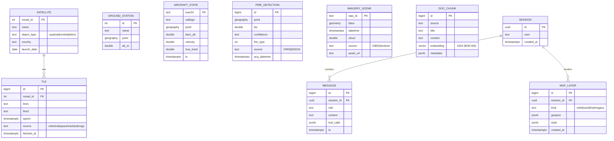
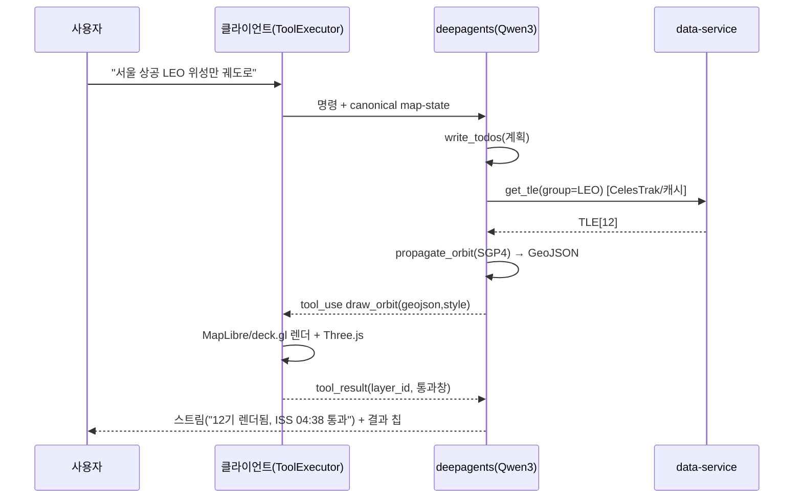
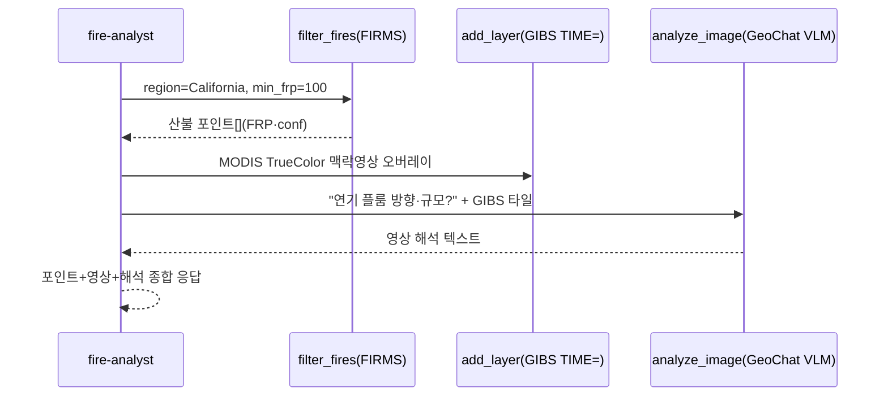

# GeoAerospace 소프트웨어 설계서 (SDD)

| 항목 | 내용 |
|---|---|
| **문서** | GeoAerospace — 항공우주 데이터 기반 대화형 지도 제어 플랫폼 소프트웨어 설계서 |
| **버전 / 상태** | v1.0 · Draft (리뷰 대기) |
| **작성자** | Gihyuk |
| **리뷰어** | (프론트엔드 리드 · 백엔드/데이터 리드 · ML/에이전트 리드 · 디자인 리드) — TBD |
| **최종 수정** | 2026-07-16 |
| **관련 문서** | [개발제안서 v0.6](./개발제안서.md) · 화면 목업([Artifact](https://claude.ai/code/artifact/2dc57f9d-1633-473a-ae53-73d3f0d15312)) · 컴포넌트 라이브러리([Artifact](https://claude.ai/code/artifact/35ca13aa-90de-4cbc-846b-162114923c7e)) |

> 본 설계서는 *무엇을 왜* 만드는지를 다룬 [개발제안서](./개발제안서.md)를 전제로, **어떻게 구현할지**(아키텍처·데이터 모델·인터페이스·시퀀스·운영·일정)를 확정하는 엔지니어링 결정 문서다. 기술 선정 근거의 상세는 제안서 해당 절을 참조한다.

---

## 1. 개요 (Overview)

GeoAerospace는 사용자가 **자연어로 명령**하면 LLM 에이전트가 위성 궤도·항공기·위성영상 데이터를 검색·해석해 **MapLibre 3D 지구본** 위에 시각화하는 웹 플랫폼이다. 핵심 산출물은 (1) **위성 궤도의 구형(球) 시각화**(3D 지구본 위 발광 궤도 링 + 지상궤적), (2) **실시간 항공 트래킹**, (3) 이를 조율하는 **대화형 LLM 제어**다. 최우선 요구는 궤도 시각화이며, 시각적 완성도("시네마틱 관제 콘솔")가 제품의 차별점이다.

궤도 계산은 **결정론적 물리 엔진(SGP4/satellite.js)** 이, 영상 해석은 **VLM(GeoChat)** 이, 지식 검색은 **RAG(pgvector)** 가 담당하고, **LangChain `deepagents`(Qwen3 백본)** 가 이 특화 컴포넌트들을 도구로 호출·조율한다. 이 분리가 설계 전반을 관통하는 원칙이다("VLM이 궤도 수치를 해석"은 범주 오류 — 제안서 §1.3).

본 설계서는 6개월(2026-07-20 킥오프 ~ 2027-01 출시 준비) 규모의 구현 계획, 데이터 모델, 에이전트-지도 인터페이스 계약, 주요 시퀀스, 운영(테스트·모니터링)·보안·비용, 미해결 결정 사항을 정의한다.

---

## 2. 컨텍스트 (Context)

- **문제:** 위성 카탈로그(TLE)·항공(ADS-B)·위성영상은 각기 다른 포맷·API·전문성을 요구해, 비전문가가 "서울 상공 위성을 궤도로 보여줘" 같은 질문에 답을 얻기 어렵다. 기존 도구는 (a) 영상 브라우저(NASA Worldview)거나 (b) 전문가용 SSA 툴이거나 (c) LLM 제어가 없다.
- **필요성:** 자연어 인터페이스 + 정확한 궤도 물리 + 시네마틱 시각화를 결합한 **대화형 지오-플랫폼**의 공백. 참조 3개 레포(osiris·worldwideview·NASA Worldview) 어느 것도 정밀 궤도 전파 + 구형 시각화 + LLM 제어를 동시에 제공하지 않는다(제안서 §2).
- **전략 정합:** 오픈소스·토큰프리·데이터 주권을 원칙으로 한다 → MapLibre(오픈), Qwen3(Apache-2.0 자체호스팅), 오픈 데이터(CelesTrak·GIBS·FIRMS·AWS Terrarium). 독점(Mapbox GL JS v2+·Google P3DT·Cesium Ion)은 코어에서 배제하거나 선택적 프리미엄으로만(제안서 §4.9).
- **배경 지식:** TLE→SGP4 전파, ECI→ECEF→측지 변환, 에이전틱 RAG(구조화=도구호출·문서=벡터검색), deepagents(계획·서브에이전트·가상FS) — 상세 제안서 §4.1·§4.3·§4.5.

---

## 3. 목표 (Goals)

| # | 목표 (사용자 가치) | 성공 지표 |
|---|---|---|
| G1 | **위성 궤도를 3D 지구본 위 구형/궤도 링으로 시각화** | 100+ 위성 궤도 링 + 지상궤적 렌더 < 200ms, 60fps 유지 |
| G2 | **자연어로 지도 제어** (이동·필터·궤도·질의) | 대표 시나리오 20종 E2E 통과율 ≥ 90% |
| G3 | **실시간 항공 트래킹** | 수천 대 ADS-B 60fps, dead-reckoning 보간 이음매 없음 |
| G4 | **위성영상 VLM 해석 + RAG 질의** | 영상 VQA 데모, 카탈로그 Q&A 정확도 벤치 통과 |
| G5 | **시네마틱 시각 완성도** | 디자인 시스템 준수, 첫인상 정성 평가 "프리미엄", 접근성 AA |
| G6 | **오픈·토큰프리 코어** | 코어 경로에 독점 토큰 의존 0, 데이터 주권 유지 |

---

## 4. 비목표 (Non-Goals)

- ❌ **정밀 충돌 예측(conjunction)/궤도 결정(OD)** — 해석적 SGP4 수준까지만. 고정밀 수치전파(Orekit)는 후속.
- ❌ **자체 관측(레이더/광학 센서) 데이터 생산** — 외부 카탈로그(CelesTrak/Space-Track) 소비만.
- ❌ **VLM의 궤도 수치 해석** — 범주 오류(§1.3). VLM은 영상 픽셀만.
- ❌ **멀티테넌시/과금 SaaS** (초기) — 단일/온프레미스 우선, 인증은 선택(§11 미해결).
- ❌ **실사 3D 도시 메시(Google P3DT)를 코어 기능으로** — 선택적 프리미엄 3D 트랙에서만.
- ❌ **모바일 네이티브 앱** — 반응형 웹까지.

---

## 5. 마일스톤 (Milestones)

킥오프 **2026-07-20(월)**. 날짜는 절대 기준(체크포인트 = 각 주 금요일). 디자인(D0)과 백엔드 기반(P0)은 부분 병렬.

| ID | 마일스톤 | 목표일 | 대응 로드맵 |
|---|---|---|---|
| **M0** | 디자인 시스템·컴포넌트 라이브러리 확정 | 2026-08-07 | D0 |
| **M1** | 시네마틱 글로브 기반(지형·대기·별필드·GIBS) | 2026-08-21 | P0 |
| **M2** | 위성 궤도 라이브(TLE→SGP4→궤도 링·지상궤적) | 2026-09-11 | P1 |
| **M3** | 실시간 항공 트래킹(ADS-B·dead-reckoning) | 2026-10-02 | P2 |
| **M4** | 3D 위성(Three.js) + 실축척 3D 궤도 뷰 | 2026-10-30 | P2.5 ∥ P2.7 |
| **M5** | RAG + 에이전트 백본·자연어 지도 제어 | 2026-12-04 | P3 → P4 |
| **M6** | VLM 통합 + GIBS/FIRMS 산불 3계층 | 2026-12-25 | P5 ∥ P5.5 |
| **M7** | 하드닝·보안·부하·출시 준비 | 2027-01-22 | P6 |

---

## 6. 기존 솔루션 (Existing Solution)

신규 그린필드이므로 "기존 구현"은 참조 레포의 부분 차용 현황이다(제안서 §2·§4.8).

- **osiris** — MapLibre+Next.js 셸 + 무료 데이터 팬아웃 + 회복탄력 관용구. → 앱 골격·데이터 파이프라인 차용. 단 자체 간이 SGP4·stealthFetch는 **거부**(§4.8-F).
- **worldwideview** — MCP Agent Bus(LLM이 글로브 제어)·DataBus·3D 성능 기법. → LLM-지도 제어 패턴·실시간 파이프라인 차용. Cesium 기반은 우리 MapLibre로 대체.
- **NASA Worldview + GIBS** — 시간축(`TIME=`) 타일 소비. → 베이스 영상·산불 맥락영상.
- **공백(신규 개발):** 정밀 궤도 전파, 구형 궤도 시각화, deepagents 오케스트레이션, 시네마틱 시각 레이어 — 본 프로젝트의 순수 net-new.

---

## 7. 제안 설계 (Proposed Solution)

### 7.1 시스템 아키텍처

```
┌──────────────────── FRONTEND (Next.js / React / TS) ────────────────────┐
│  Chat UI (오버레이 드로어)        MapLibre v5 globe (풀블리드)           │
│    · 명령 입력(⌘K)                 + deck.gl (궤도/지상궤적/항공/FIRMS)   │
│    · 에이전트 계획 스텝            + Three.js custom layer (glTF/튜브/콘) │
│    · 결과 칩                       + 3D terrain(Terrarium) + GIBS raster  │
│  Zustand canonical map-state ─────── satellite.js (클라이언트 60fps 전파)│
└───────────┬───────────────────────────────────┬─────────────────────────┘
            │ WebSocket/SSE (tool_use / tool_result / 토큰 스트림)          │
┌───────────▼───────────── BACKEND (LangGraph Server) ─────────────────────┐
│  deepagents (Qwen3 @ vLLM)                                                │
│   ├ 서브에이전트: orbit / imagery / gis-query / fire-analyst              │
│   └ 도구: get_tle · propagate_orbit · query_aircraft · analyze_image      │
│           · retrieve_docs · filter_fires · fly_to/add_layer/draw_orbit …  │
│  MCP DataSrv        RAG(pgvector+BM25)      결정론적 천체역학(sgp4/Skyfield)│
│  VLM(GeoChat @ vLLM)                        SSRF 가드 · 회복탄력 팬아웃     │
└─────┬──────────────────────────────┬─────────────────────┬───────────────┘
   PostgreSQL+PostGIS+pgvector     Redis(캐시·큐·RL)     외부 데이터(SSRF 통과)
                                                    CelesTrak·Space-Track·SatNOGS
                                                    OpenSky·airplanes.live·adsb.lol
                                                    GIBS·STAC·FIRMS·EONET·Terrarium
```

### 7.2 컴포넌트 분해

| 계층 | 컴포넌트 | 책임 |
|---|---|---|
| **Frontend** | `MapCanvas` | MapLibre globe + deck.gl 오버레이 + Three.js custom layer 렌더 |
| | `OrbitRenderer` | satellite.js 매 프레임 전파 → 위성 위치/궤도 링 업데이트(§7.4) |
| | `ChatDrawer` | LangGraph 스트림 구독, 계획 스텝·결과 표시, tool executor |
| | `ToolExecutor` | `tool_use` → 실제 `maplibregl.Map` 호출 매핑, `tool_result` 반환 |
| | `mapStateStore` (Zustand) | canonical map-state(center/zoom/layers/filters/visible ids) |
| **Backend** | `agent-server` (LangGraph) | deepagents 그래프, 세션 스레드 영속, 토큰 스트리밍 |
| | `data-service` | 외부 API 팬아웃·정규화·캐싱·SSRF 가드 |
| | `mcp-server` | 데이터 도구를 MCP(Stateless Streamable HTTP)로 노출 |
| | `model-serving` | vLLM(Qwen3 백본, GeoChat VLM) OpenAI 호환 엔드포인트 |
| **Data** | PostgreSQL+PostGIS+pgvector | 카탈로그·공간질의·벡터·세션 |
| | Redis | 핫 캐시·글로브 커맨드 큐·레이트리밋 |

### 7.3 데이터 모델 (PostGIS + pgvector)



- **인덱스:** `tle(norad_id, epoch desc)`; PostGIS GiST on 모든 `geography/geometry`; **pgvector HNSW** on `doc_chunk.embedding`; `doc_chunk`는 hybrid(dense+BM25 `tsvector`).
- **핫 데이터:** `aircraft_state`는 고빈도 → Redis TTL 캐시 우선, Postgres는 스냅샷/조회용. TLE는 4h 디스크/Redis 캐시(§4.8-B).
- **세션:** LangGraph 스레드 체크포인트가 `session`/`message`에 매핑(영속·재개).

### 7.4 궤도 렌더링 파이프라인 (핵심 — G1)

서버·클라이언트 이중 실행(제안서 §4.1):

```
[서버 · propagate_orbit 도구]                [클라이언트 · OrbitRenderer]
 TLE/OMM (CelesTrak/cache)                    satrec (twoline2satrec)
   │                                            │  매 프레임(rAF, 경과시간 기반)
   ├ SGP4 (sgp4/Skyfield 검증)                  ├ propagate(satrec, now) → ECI
   ├ 한 주기 샘플(N=90~360)                     ├ gstime → GMST
   ├ ECI→GMST 회전→ECEF→측지                    ├ eciToEcf → ecfToGeodetic
   ├ 궤도 링(고도 유지) + 지상궤적(h=0)          ├ [lon,lat,alt] 위성 현재 위치
   └ GeoJSON + 스타일 → draw_orbit 반환         └ deck.gl PathLayer/Scatterplot 갱신
                                                   + Three.js custom layer(glTF/튜브/콘)
```
- **정적 산출물**(궤도 링·통과 시각)은 서버 도구가 계산해 tool_result로 반환.
- **실시간 위성 위치**(60fps 애니메이션)는 클라이언트가 매 프레임 전파.
- **렌더 규칙:** 대권 아크는 촘촘 샘플(globe subdivision 128 대응), ±180° 분할, `MapboxOverlay` interleaved로 궤도가 지구 뒤로 오클루전. 궤도는 **선택 시에만** 렌더(노이즈 방지). 시각: 가산 블렌딩 + bloom(§4.10).
- **정확도 게이트:** satellite.js 결과를 서버 Skyfield/sgp4 골든값과 대조(오차 임계 CI).

### 7.5 에이전트·도구 계약 (deepagents)

`create_deep_agent(model=ChatOpenAI(vLLM Qwen3), tools=[...], subagents=[...])` (제안서 §4.5).

| 도구 | 시그니처 | 반환 | 계층 |
|---|---|---|---|
| `get_tle` | `(norad_id\|group)` | TLE/OMM(+캐시 메타) | 데이터 |
| `propagate_orbit` | `(tle, window, step)` | 궤도 링·지상궤적 GeoJSON·통과 | 물리 |
| `query_aircraft` | `(bbox, filters)` | ADS-B 상태벡터[] | 데이터 |
| `filter_fires` | `(region,date,day_range,min_frp,…)` | 산불 포인트[]+요약 | 데이터 |
| `retrieve_docs` | `(query, k)` | 문서 청크[](하이브리드) | RAG |
| `analyze_image` | `(image_ref, question)` | VLM 텍스트 답 | VLM |
| `fly_to` | `(lng,lat,zoom,pitch)` | ack | 지도(클라) |
| `set_filter` | `(layer_id, expression)` | ack | 지도(클라) |
| `add_layer` | `(id,type,source,paint)` | layer_id | 지도(클라) |
| `draw_orbit` | `(norad_id)` | layer_id | 지도(클라) |
| `query_data` | `(layer,bbox,predicate)` | 결과 집합 | 지도(클라) |

- **서버/클라 분리:** 데이터·물리·RAG·VLM 도구는 서버(LangGraph). 지도 조작 도구는 **라이브 `Map` 필요 → 클라이언트 executor**가 실행하고 `tool_result` 회신.
- **그라운딩:** 좌표는 LLM이 생성 금지, `geocode()`(Nominatim)/`query_data()` 강제. canonical map-state를 매 턴 주입.
- **MCP:** 데이터 도구는 MCP 서버(Stateless Streamable HTTP, Bearer, 120req/60s)로도 노출 → 외부 LLM 재사용.

### 7.6 주요 시퀀스

**(A) 자연어 → 궤도 렌더 (G1·G2)**


**(B) 산불 3계층 (G4)** — `fire-analyst` 서브에이전트가 오케스트레이션(§4.7):


### 7.7 UX/UI·시각 설계 통합

- **디자인 시스템:** "Orbital Command" — 단일 다크 월드, 컬러 "Midnight×Golden Horizon"(시안 데이터·앰버 추적, 90/8/2 비율), 시스템 산세리프+모노 텔레메트리(제안서 §4.10).
- **컴포넌트:** 20종 라이브러리(글라스 패널·HUD 카드·레이어 칩·타임 스크러버·AI 챗·상태 필·스파크라인 …) → [컴포넌트 라이브러리 Artifact](https://claude.ai/code/artifact/35ca13aa-90de-4cbc-846b-162114923c7e). 구현 이관 = React 컴포넌트 + CSS 변수 토큰.
- **시그니처 렌더:** bloom 후처리·가산 블렌딩 궤도 링·프레넬 림글로우·별필드·거리 포그·로그이징 fly-to(§4.10). MapLibre `type:'custom'` 레이어에 발광 렌더러 주입.
- **레이아웃:** map-first 풀블리드, 컨트롤은 글라스 부유, AI 챗=오버레이 드로어(split-pane 금지).

### 7.8 배포 토폴로지

- **컨테이너:** Docker 멀티스테이지(non-root) + docker-compose: `web`(Next.js standalone) · `agent`(LangGraph Server) · `db`(Postgres+PostGIS+pgvector) · `redis` · `vllm`(GPU) · `nginx`(타일 캐시 프록시).
- **모델:** 개발 = 로컬 vLLM/Ollama(Qwen3-8B 4bit, RTX 3060 12GB). 프로덕션 = 관리형 GPU 엔드포인트 또는 상위 GPU(Qwen3-30B-A3B) + GeoChat VLM(HF Inference Endpoints 오토스케일).
- **타일 캐시:** nginx가 GIBS/Terrarium 타일 캐싱(1년) → 외부 요청·지연 감소.

---

## 8. 대안 설계 (Alternatives)

제안서에서 검토·기각한 대안 요약(상세는 제안서):

- **렌더러:** CesiumJS(궤도 도메인 적합) → MapLibre 명시 요구로 1차 기각, 실축척 3D 뷰에서만 보조 트랙(§4.6-B). Mapbox GL JS → 독점 라이선스로 기각(§4.9-A).
- **에이전트 백본:** Claude Tool use(관리형) → 데이터 주권·비용 이유로 자체호스팅 Qwen3로 교체(§4.5). 대안 후보: Mistral-Small-3.2·GLM-4.5-Air·Llama-3.3.
- **궤도 전파:** 자체 간이 SGP4 → 정확도 기각, 표준 satellite.js/Skyfield 채택(§4.8-F). 고정밀 Orekit → 초기 비목표.
- **벡터 DB:** FAISS/Chroma/Qdrant → pgvector(PostGIS 동일 저장소, 하이브리드 질의)로 통합.
- **3D 지형/실사:** MapTiler(토큰)·Google P3DT(과금)·Cesium Ion(토큰) → 오픈 AWS Terrarium/Copernicus DEM 우선, 프리미엄은 선택(§4.9).

---

## 9. 테스트 · 모니터링 · 알림

**테스트(다층, §4.8-E):**
- **단위(Vitest):** SGP4 전파 골든값 대조(vs Skyfield), 좌표 변환(ECI→측지), 도구 인자 검증.
- **속성(fast-check):** 좌표 변환 불변식(왕복 변환 오차 ε 이내), ±180° 분할.
- **E2E(Playwright):** 대표 시나리오 20종 "자연어→지도조작"(G2 지표).
- **계약(Pact):** WS 페이로드·도구 스키마(프론트↔에이전트).
- **뮤테이션(Stryker):** 핵심 물리/변환 로직 커버리지 검증. **번들(size-limit).**

**모니터링(지표):**
| 지표 | 대상 |
|---|---|
| 에이전트 도구 성공률 / Qwen3 도구포맷 이탈률 | 백본 신뢰성(§7 리스크) |
| TLE 신선도(마지막 갱신 경과) | 궤도 정확도 |
| 외부 API 429/에러율(OpenSky·FIRMS·STAC) | 회복탄력 |
| 렌더 FPS / 프레임 드롭 | G1·G3 |
| VLM 엔드포인트 p95 지연 | G4 |
| SSRF 차단 수 / 레이트리밋 히트 | 보안 |
| LangGraph 트레이스(스텝·토큰·지연) | 관측성 |

**알림:**
- TLE stale > 24h → 재수집 파이프라인 경보.
- FIRMS `MAP_KEY` 쿼터 > 80% / OpenSky 429 지속 → 폴백 소스 전환.
- VLM p95 > 임계 / 에이전트 에러율 > 임계 → 온콜.
- 궤도 정확도 CI(골든값 오차) 초과 → 배포 차단.

---

## 10. 크로스팀 영향 (Cross-Team Impact)

**비용(월, 추정 — 확정 전 재견적):**
- **GPU:** 프로덕션 백본(Qwen3-30B-A3B) 관리형 엔드포인트 또는 1×A100/H100급 + GeoChat VLM(HF Inference Endpoints 오토스케일, 사용량 기반) — 최대 비용 항목.
- **DB/인프라:** 관리형 Postgres(PostGIS+pgvector) + Redis + 앱 노드.
- **데이터/전송:** CelesTrak·GIBS·FIRMS·AWS Terrarium **무료**(nginx 캐시로 egress 절감). FIRMS `MAP_KEY` 5000req/10분(무료).
- **선택적 프리미엄:** Google P3DT ~$6 CPM · Cesium Ion 상업 ~$149/월 — 3D 트랙 도입 시에만. ⚠️ 벤더 가격 개정 재확인.

**보안:**
- **SSRF 가드**(사용자 입력→외부 fetch 전 경로): host 검증·리다이렉트 재검증·allowlist(§4.8-B). **최우선.**
- **비밀 관리:** FIRMS `MAP_KEY`·Space-Track 자격·OpenSky OAuth2 토큰은 **백엔드 전용**, 프론트 노출 절대 금지.
- **CSP:** MapLibre/Three.js 워커(`worker-src`/`blob:`) 허용, 그 외 최소.
- **레이트리밋:** Redis 중앙화. **stealthFetch(위조 헤더 우회) 금지**(ToS 준수, §4.8-F).
- **라이선스/저작권:** Copernicus/GIBS 표기, 프리미엄(Google/Cesium) 저작권 표시 의무.

**DevOps:** GPU 노드 프로비저닝, LangGraph Server 배포, 컨테이너 CI(다층 테스트 게이트), 궤도 정확도 CI 게이트.

**부수효과:** 외부 공개 API 부하 → 캐시·백오프·다중 소스로 정당하게 관리(우회 금지).

---

## 11. 미해결 질문 (Open Questions)

1. **프로덕션 백본 배포처** — 자체 GPU vs 관리형 엔드포인트? (비용·데이터주권 트레이드오프)
2. **실축척 3D 궤도 뷰 엔진** — CesiumJS vs R3F 택1 (P2.7 스파이크 후 결정, §4.6-B).
3. **멀티테넌시/인증** — Better Auth 도입 여부(단일 온프레미스 vs SaaS). 비목표에서 승격 시 데이터 모델에 `workspace`·`user` 확장.
4. **임베딩 모델·차원** — BGE-M3(1024) 확정? 재색인/버전 전략.
5. **지오코더** — Nominatim 셀프호스팅 vs 공개 인스턴스(레이트·ToS).
6. **프리미엄 도입 범위** — Google P3DT/Cesium Ion을 어느 시나리오까지·예산 한도?
7. **`deepagents` 버전 핀** — pre-1.0 API 변동 대비 고정 버전 확정.
8. **TLE 소스 정책** — Space-Track 계정(권위) 도입 시점 vs CelesTrak 단독.

---

## 12. 상세 타임라인 (엔지니어 레벨)

| 기간 | 트랙 A (디자인·프론트) | 트랙 B (백엔드·데이터·에이전트) |
|---|---|---|
| **D0** 07-20~08-07 | 디자인 토큰·컴포넌트 라이브러리·목업 3~5·모션 스펙 | 리포/CI 부트스트랩, Postgres+PostGIS+pgvector 스키마, Docker 컴포즈 |
| **P0** 08-10~08-21 | MapLibre globe + 3D 지형(Terrarium) + 대기/별필드/fly-to 이징 | GIBS 타일 프록시(nginx), SSRF 가드 골격, data-service 스캐폴드 |
| **P1** 08-24~09-11 | deck.gl 궤도 링/지상궤적, OrbitRenderer(satellite.js), 선택 렌더 | `get_tle`(CelesTrak+캐시+SatNOGS 폴백), `propagate_orbit`, 정확도 CI(vs Skyfield) |
| **P2** 09-14~10-02 | IconLayer/TripsLayer, dead-reckoning(Turf) | 항공 다중폴백(OpenSky/airplanes.live/adsb.lol), single-flight, 429 쿨다운 |
| **P2.5∥P2.7** 10-05~10-30 | Three.js custom layer(glTF/튜브/콘, LOD), 실축척 3D 뷰(스파이크→택1) | 궤도 통과 예측, 센서 FOV, 상태 동기화 API |
| **P3→P4** 11-02~12-04 | ChatDrawer·ToolExecutor·canonical map-state, 계획 스텝 UI | pgvector 하이브리드 RAG, deepagents 그래프+서브에이전트, vLLM(Qwen3) 서빙, MCP 서버 |
| **P5∥P5.5** 12-07~12-25 | 산불/영상 결과 UI, 레전드·타임 스크러버 완성 | `analyze_image`(GeoChat), `filter_fires`(FIRMS VIIRS→MODIS·EONET), STAC 검색 |
| **P6** 2027-01-05~01-22 | 접근성 AA·reduced-motion·반응형 마감 | MCP 하드닝, SSRF·레이트리밋·부하 테스트, Playwright/Pact 게이트, 관측성 |

---

## 13. 부록 · 참조

- 기술 선정 근거·논문·데이터소스: [개발제안서 v0.6](./개발제안서.md) §4~§8.
- 시각 컨셉: 화면 목업 · 컴포넌트 라이브러리(상단 링크).
- 내부 분석: `worldview-main/doc/2026-07-14_gibs_firms_기술구현분석.md`, `큐브위성사업/기술분석/0716_WWV_*`, `0716_OSIRIS_*`.

*본 설계서는 dev.to "좋은 소프트웨어 설계 문서 작성법" 구조(개요→컨텍스트→목표/비목표→마일스톤→기존/제안 솔루션→대안→테스트·모니터링→크로스팀 영향→미해결 질문→상세 타임라인)를 따른다.*
